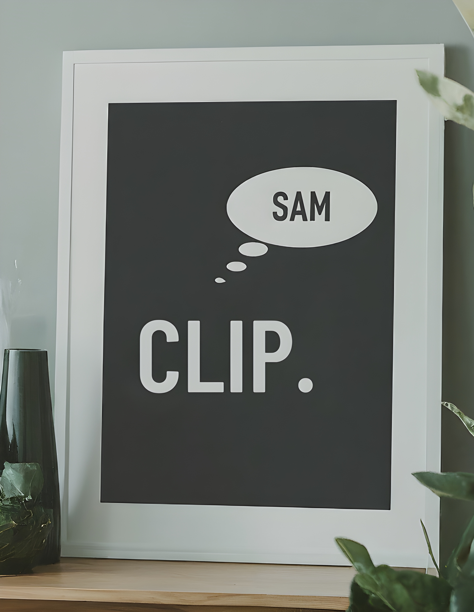

<!-- PROJECT SHIELDS -->
[![Contributors][contributors-shield]](https://github.com/rhysdg/ollama-voice-jetson/contributors)
[![Apache][license-shield]][license-url]
[![LinkedIn][linkedin-shield]][linkedin-url]

<!-- PROJECT LOGO -->
<br />
  <h3 align="center"> SAM at a CLIP: Multimodal Vision at Speed</h2>
  <p align="center">
     Low-latency image segmentation with contrastive language-image pre-training
     <br />
    <a href="https://github.com/rhysdg/sam-at-a-clip/wiki"<strong>Explore the docs »</strong></a>
    <br />
    <br />
    
    <br />
    <br />
    <a href="https://github.com/rhysdg/sam-at-a-clip/issues">Report Bug</a>
    .
    <a href="https://github.com/rhysdg/sam-at-a-clip/issues">Request Feature</a>
  </p>
</p>

<!-- TABLE OF CONTENTS -->
## Table of Contents

* [About the Project](#about-the-project)
  * [Built With](#built-with)
  * [The Story so Far](#the-story-so-far)
* [Getting Started](#getting-started)
  * [Prerequisites](#prerequisites)
  * [Scripts and Tools](#scripts-and-tools)
  * [Supplementary Data](#supplementary-data)
* [Proposed Updates](#proposed-updates)
* [Contact](#contact)

<!-- ABOUT THE PROJECT -->
## About The Project

### Built With

* [Onnxruntime](https://onnxruntime.ai/)


### The Story So Far

So what's going on here? There have been a lot of developments in the last year or so with deployable foundational model - keeping up is difficult so the idea is to have a one-stop shop for a few things:

A concerted class - and eventually a Python package - allowing for the deployment of an ONNX accelarated representation of CLIP and it's latest improved variants - like SigLIP - in conjunction with SAM (Segment Anything) as a multi-modal localisation and labelling tool.

You'll find that all models and pipelines are available to you as separate tools too - should you wish to classify with SigLIP alone then all good, SAM by itself - no problem 

Last of all the aim here is to keep up with the latest optimised foundational models as we go. Most importantly the aim is to ensure that ONNX and TensorRT representations are available for use. So far we have: 

- Open AI's original [CLIP](https://openai.com/index/clip/) - ViT-B/32 basedconverted to ONNX
- [Siglip](https://arxiv.org/abs/2303.15343) ONNX - FP16 with a quantized variant around the corner, TRT is in our future scope too.
- CLIP surgery - [paper](https://arxiv.org/abs/2304.05653)
- [Segment Anything](https://github.com/facebookresearch/segment-anything) ONNX - TRT on it's way


<!-- GETTING STARTED -->
## Getting Started:

- Right now installation is as simple as the command below in a virtual envirionment from the root of this project - see the notebook referenced below for a live demo:

  ```bash
  git clone https://github.com/rhysdg/sam-at-a-clip.git
  pip install -r requirements.txt

  ```

- SigLIP is available and recommended by default given the innovation made at with it's loss function leading to better inference. model types however can be changed at instantiation with:

  ```python
  onnx_model = OnnxClip(batch_size=16, type='siglip')
  ```

- Notice also cosine similrity at `get_similarity_scores` is adusted to handle multiple context - in other words a handful of text embedding can be sent as 'contexts', and send to the function to be evaluated against a single image or a batch of images.

- Not also that an `OnnxSAM` class is also available with the same instantiation and automatic model download - further examples are on their way along with SigLIP integration


## Example usage (CLIP/SigLIP - SAM incoming) :
```python
from clip.model import OnnxClip, softmax, get_similarity_scores
from PIL import Image

images = [Image.open("clip/data/dog.jpg").convert("RGB")]

texts = {"classification": ["a photo of a man", "a photo of a woman", "s photo of a dog"],
         "situational": ["a dog standing up", "a dog running", "a dog laying on grass"],
     }


onnx_model = OnnxClip(batch_size=16, type='siglip')

image_embeddings = onnx_model.get_image_embeddings(images)
text_embeddings_class = onnx_model.get_text_embeddings(texts['classification'])
text_embeddings_situational = onnx_model.get_text_embeddings(texts['situational'])


contexts = {"classification": text_embeddings_class,
            "situational": text_embeddings_situational,
           }

logits = get_similarity_scores(image_embeddings, contexts)
probabilities = softmax(logits['classification'])


for k,v in contexts.items():
    
    print(f'\ncontext: {k}\n')
    probabilities = softmax(logits[k])
    
    for text, p in zip(texts[k], probabilities[0]):
        probabilities = softmax(logits['classification'])
        print(f"Probability that the image is '{text}': {p:.3f}")
```

## Customisation:

- **Coming soon**


### Notebooks

1. Coming soon

### Tools and Scripts
1. **coming soon**


### Testing

 - Pending

### Models & Latency benchmarks

**All downloadable model are in `.onnx` format - noting that these are automatically secured with `OnnxClip` and `OnnxSAM` too

|model| CLIP Score | Deployment |speed(ms) |TensorRT FP16 status|ms (FP16)| FPS (quantized)| 
| ------- | --- | --- | ---| --- |--- |---|
| SigLIP 384 FP16 - [text](https://drive.google.com/file/d/1oUl6H3Y0Az8F1GGXVmEPPcy52dasWeiD/view?usp=drive_link) | pending |RTX 3080 </br> AGX Xavier  | pending </br>  pending |pending </br> pass| pending </br> pending| pending </br> pending | 
| SigLIP 384 FP16 - [image](https://drive.google.com/file/d/1vZvBZIDPzax2AfoYwRWO7neo2SxoScEX/view?usp=drive_link) | pending | RTX 3080 </br> AGX Xavier | pending </br>  pending | pending  </br> pass| pending </br> pending | pending </br> pending
| CLIP vitb32 - [text](https://drive.google.com/file/d/1EC2ju-gIlLfBJ3un-1G5QFQzYi8DoA9o/view?usp=drive_link) | pending | RTX 30800 </br> AGX Xavier | pending </br> pending | pending  </br> pass| pending </br> pending |pending </br> pending| |
| CLIP vitb32 - [image](https://drive.google.com/file/d/1WbRBDaBLsVdAZRD_1deq0uYGhIVFNoAi/view?usp=drive_link)| pending | RTX 30800 </br> AGX Xavier | pending </br> pending | pending  </br> pass| pending </br> pending |pending </br> pending| |
| CLIP Surgery vitb32 | pending | RTX 30800 </br> AGX Xavier | pending </br> pending | pending  </br> pass| pending </br> pending |pending </br> pending| |
| CLIP Surgery vitb32 | pending | RTX 30800 </br> AGX Xavier | pending </br> pending | pending  </br> pass| pending </br> pending |pending </br> pending| |

|model| Score | Deployment |speed(ms) |TensorRT FP16 status|ms (FP16)| FPS (quantized)| 
| ----------------------- | --- | --- | ---| --- |--- |---|
| SAM ViT-L ONNX - [encoder](https://drive.google.com/file/d/1cxFVincc2-Yi1WACbC46l9vF4rJoilq5/view?usp=drive_link)  | pending |RTX 3080 </br> AGX Xavier  | pending </br>  pending |pending </br> pass| pending </br> pending| pending </br> pending | 
| SAM ViT-L ONNX - [decoder](https://drive.google.com/file/d/1xIx_jKftt8P4HEzNyKlm3S2Z-9pPdu9C/view?usp=drive_link)  | pending |RTX 3080 </br> AGX Xavier  | pending </br>  pending |pending </br> pass| pending </br> pending| pending </br> pending | 


### Similar projects

- Pending

<!-- PROPOSED UPDATES -->
## Latest Updates
- Pending

<!-- PROPOSED UPDATES -->
## Future updates

- CLIP/SigLIP attention transfomred to multi point SAM inference - **in progress**
- Python packaging - **scheduled**
- TensorRT - **pending**
- CUDA accelarated SigLIP based vector seacrh with [chromadb](https://www.trychroma.com/) - **pending**
- [ollama](https://www.ollama.com/) support - **pending**

<!-- Contact -->
## Contact
- Project link: https://github.com/rhysdg/sam-at-a-clip
- Email: [Rhys](rhysdgwilliams@gmail.com)


<!-- MARKDOWN LINKS & IMAGES -->
[build-shield]: https://img.shields.io/badge/build-passing-brightgreen.svg?style=flat-square
[contributors-shield]: https://img.shields.io/badge/contributors-2-orange
[license-shield]: https://img.shields.io/badge/License-GNU%20GPL-blue
[license-url]: LICENSE.txt
[linkedin-shield]: https://img.shields.io/badge/-LinkedIn-black.svg?style=flat-square&logo=linkedin&colorB=555
[linkedin-url]: https://www.linkedin.com/in/rhys-williams-b19472160/
