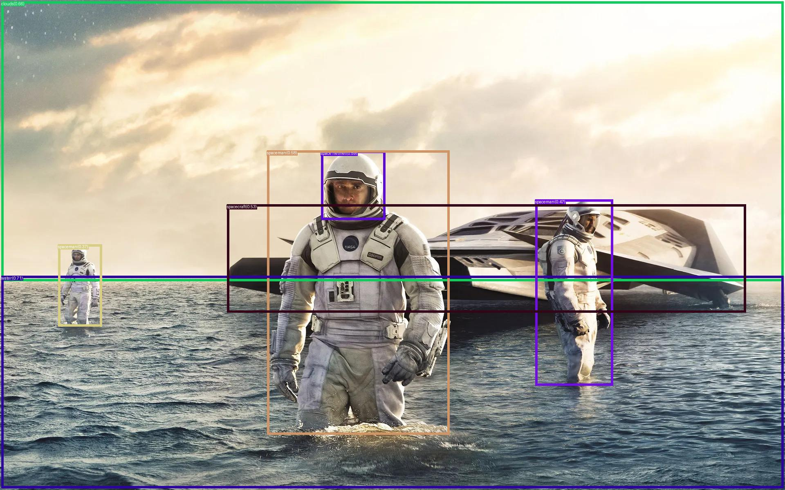

<!-- PROJECT SHIELDS -->
[![Contributors][contributors-shield]](https://github.com/rhysdg/ollama-voice-jetson/contributors)
[![Apache][license-shield]][license-url]
[![LinkedIn][linkedin-shield]][linkedin-url]

<!-- PROJECT LOGO -->
<br />
  <h3 align="center"> Vision at a CLIP: Multimodal Vision at Speed</h2>
  <p align="center">
     Low-latency image rationalization and search with contrastive language-image pre-training
    <br />
    <br />
     CLIP | SigLIP  | GroundingDINO  | X-CLIP
    <br />
    <br />
    <a href="https://github.com/rhysdg/sam-at-a-clip/wiki"<strong>Explore the docs »</strong></a>
    <br />
    <br />
    
    <br />
    <br />
    <a href="https://github.com/rhysdg/sam-at-a-clip/issues">Report Bug</a>
    .
    <a href="https://github.com/rhysdg/sam-at-a-clip/issues">Request Feature</a>
  </p>
</p>

<!-- TABLE OF CONTENTS -->
## Table of Contents

* [About the Project](#about-the-project)
  * [Built With](#built-with)
  * [The Story so Far](#the-story-so-far)
* [Getting Started](#getting-started)
  * [Prerequisites](#prerequisites)
  * [Scripts and Tools](#scripts-and-tools)
  * [Supplementary Data](#supplementary-data)
* [Proposed Updates](#proposed-updates)
* [Contact](#contact)

<!-- ABOUT THE PROJECT -->
## About The Project

### Built With

* [Onnxruntime](https://onnxruntime.ai/)


### The Story So Far

So what's going on here? There have been a lot of developments in the last year or so with deployable foundation model - keeping up is difficult so the idea is to have a one-stop shop for a few things:

A concerted class - and eventually a Python package - allowing for the deployment of an ONNX accelarated representation of CLIP and it's latest improved variants - like SigLIP - in conjunction with SAM (Segment Anything) as a multi-modal localisation and labelling tool.

You'll find that all models and pipelines are available to you as separate tools too - should you wish to classify with SigLIP alone then all good, SAM by itself - no problem 

Last of all the aim here is to keep up with the latest optimised foundation models as we go. This includes optimised postprocessing and an test time augmentations that can help with inference quality. Most importantly the aim is to ensure that ONNX and TensorRT representations are available for use. So far we have: 

- Open AI's original [CLIP](https://openai.com/index/clip/) - ViT-B/32 based converted to ONNX with full inference class
- [Siglip](https://arxiv.org/abs/2303.15343) ONNX - FP16 with a quantized variant around the corner, TRT is in our future scope too.
- [GroundingDINO](https://github.com/IDEA-Research/GroundingDINO) - Swin T based with a bert incased text encoder, converted to ONNX, FP32, mixed precision (dynamic quant shortly), with a full inference API3
- [Segment Anything](https://github.com/facebookresearch/segment-anything) ONNX - TRT on it's way


<!-- GETTING STARTED -->
## Getting Started:

- Right now installation is as simple as the command below in a virtual envirionment from the root of this project - see the notebook referenced below for a live demo:

  ```bash
  git clone https://github.com/rhysdg/sam-at-a-clip.git
  pip install -r requirements.txt

  ```

- SigLIP is available and recommended by default given the innovation made at with it's loss function leading to better inference. model types however can be changed at instantiation with:

  ```python
  onnx_model = OnnxLip(batch_size=16, type='siglip_full')
  ```

- Notice also cosine similrity at `get_similarity_scores` is adusted to handle multiple context - in other words a handful of text embedding can be sent as 'contexts', and send to the function to be evaluated against a single image or a batch of images.

- hidden states are also available at `onnx_model.hidden_image` and `onnx_model.hidden_text` when using `type=siglip` for extraction only - allowing for analysis, attention plotting and multi-point processing as input to SAM. Watch this space for more on this.

- Not also that an `OnnxSAM` class is also available with the same instantiation and automatic model download - further examples are on their way along with SigLIP integration


## Example usage:

### CLIP/SigLIP

- For the full 384 SigLIP model go ahead and use the `.inference` method as follows. Noting that CLIP is avaiable via the same method. Either model will switch between softmax and sigmoid accordingly:

  ```python
  from PIL import Image
  from sam.model import OnnxSAM
  from clip.model import OnnxLip, softmax, get_probabilities

  images = [Image.open("images/dog.jpg").convert("RGB")]

  texts = {"classification":  ["a photo of space",
                              "a photo of a dog",
                              "a photo of a dog with flowers laying on grass",
                              "a photo of a brown and white dog with blue flowers laying on grass",
                              "a photo of a brown and white dog with yellow flowers laying on grass"],
      }

  #type='clip' is also avvaiilable with this usage    
  onnx_model = OnnxLip(batch_size=16, type='siglip_full')
  probs, _ = onnx_model.inference(images, texts)

  for k,v in texts.items():
      print(f'\ncontext: {k}\n')
      for text, p in zip(texts[k], probs[k]):
          print(f"Probability that the image is '{text}': {p:.3f}")

  ```

- For cosine similarity based models manual extraction as a precursor can be used as follows (noting that SigLIP text and image encoders arre available despite a different loss):

  ```python
  from PIL import Image
  from sam.model import OnnxSAM
  from clip.model import OnnxLip, softmax, get_probabilities


  images = [Image.open("images/dog.jpg").convert("RGB")]

  texts = {"classification": ["a photo of a man", "a photo of a woman", "s photo of a dog"],
          "situational": ["a dog standing up", "a dog running", "a dog laying on grass"],
      }


  onnx_model = OnnxLip(batch_size=16, type='clip')

  image_embeddings = onnx_model.get_image_embeddings(images)
  text_embeddings_class = onnx_model.get_text_embeddings(texts['classification'])
  text_embeddings_situational = onnx_model.get_text_embeddings(texts['situational'])


  contexts = {"classification": text_embeddings_class,
              "situational": text_embeddings_situational,
            }

  probs, logits = get_probabilities(image_embeddings, contexts)

  for k,v in contexts.items():
      print(f'\ncontext: {k}\n')
      for text, p in zip(texts[k], probs[k]):
          print(f"Probability that the image is '{text}': {p:.3f}")
  ```

### Grounding DINO

- For zero-shot object detection go ahead and build from the following example:

  ```python

  import os
  import time
  import logging
  import torch
  import numpy as np
  from gdino.model import OnnxGDINO
  from  utils.gdino_utils import load_image, plot_boxes_to_image

  logging.basicConfig(level=logging.INFO)

  output_dir = 'output'

  ogd = OnnxGDINO()

  payload = ogd.preprocess_query("spaceman. spacecraft. water. clouds. space helmet")
  img, img_transformed = load_image('/images/wave_planet.webp')

  img.save(os.path.join(output_dir, "pred.jpg"))

  filtered_boxes, predicted_phrases = ogd.inference(img_transformed.astype(np.float32), 
                                                    payload,
                                                    text_threshold=0.25, 
                                                    box_threshold=0.35,)

  size = img.size
  pred_dict = {
      "boxes": filtered_boxes,
      "size": [size[1], size[0]],
      "labels": predicted_phrases,
  }

  prediction = viz(img, pred_dict)[0]
  predicitons.save(os.path.join(output_dir, "pred.jpg"))
  
  ```

## Customisation:

- **Coming soon**


### Notebooks

1. [SigLIP Onnx](notebooks/siglip_onnx.ipynb) - A simple railed overview of the usage above - noting that the Huggingface AutoTokenizer is pretty verbose and cost heavy, work is underway to bring a numpy only solution in shorlty

### Tools and Scripts
1. **Coming soon**


### Testing

 - CI/CD will be expanded as we go - all general instantiation test pass so far.

### Models & Latency benchmarks

**All downloadable model are in `.onnx` format - noting that these are automatically secured with `OnnxClip` and `OnnxSAM` too

|model| CLIP Score | Deployment |speed(ms) |TensorRT FP16 status|ms (FP16)| FPS (quantized)| 
| ------- | --- | --- | ---| --- |--- |---|
| SigLIP 384 FP16 - [text](https://drive.google.com/file/d/1oUl6H3Y0Az8F1GGXVmEPPcy52dasWeiD/view?usp=drive_link) | pending |RTX 3080 </br> AGX Xavier  | pending </br>  pending |pending </br> pass| pending </br> pending| pending </br> pending | 
| SigLIP 384 FP16 - [image](https://drive.google.com/file/d/1vZvBZIDPzax2AfoYwRWO7neo2SxoScEX/view?usp=drive_link) | pending | RTX 3080 </br> AGX Xavier | pending </br>  pending | pending  </br> pass| pending </br> pending | pending </br> pending
| CLIP vitb32 - [text](https://drive.google.com/file/d/1EC2ju-gIlLfBJ3un-1G5QFQzYi8DoA9o/view?usp=drive_link) | pending | RTX 3080 </br> AGX Xavier | pending </br> pending | pending  </br> pass| pending </br> pending |pending </br> pending| |
| CLIP vitb32 - [image](https://drive.google.com/file/d/1WbRBDaBLsVdAZRD_1deq0uYGhIVFNoAi/view?usp=drive_link)| pending | RTX 3080 </br> AGX Xavier | pending </br> pending | pending  </br> pass| pending </br> pending |pending </br> pending| |
| CLIP Surgery vitb32 | pending | RTX 3080 </br> AGX Xavier | pending </br> pending | pending  </br> pass| pending </br> pending |pending </br> pending| 
| CLIP Surgery vitb32 | pending | RTX 3080 </br> AGX Xavier | pending </br> pending | pending  </br> pass| pending </br> pending |pending </br> pending| |

|model| Score | Deployment |speed(ms) |TensorRT FP16 status|ms (FP16)| FPS (quantized)| 
| ----------------------- | --- | --- | ---| --- |--- |---|
| SAM ViT-L ONNX - [encoder](https://drive.google.com/file/d/1cxFVincc2-Yi1WACbC46l9vF4rJoilq5/view?usp=drive_link)  | pending |RTX 3080 </br> AGX Xavier  | pending </br>  pending |pending </br> pass| pending </br> pending| pending </br> pending | 
| SAM ViT-L ONNX - [decoder](https://drive.google.com/file/d/1xIx_jKftt8P4HEzNyKlm3S2Z-9pPdu9C/view?usp=drive_link)  | pending |RTX 3080 </br> AGX Xavier  | pending </br>  pending |pending </br> pass| pending </br> pending| pending </br> pending | 


### Similar projects

- Pending

<!-- PROPOSED UPDATES -->
## Latest Updates
- Added a Gradio example app. Ignore the percentages for now or rather think of each as the pairwise confidence for an image and a particular prompt - the results of simgoid outputs don't sum to 1 in concert. The results however are pretty impressive! - simply run `python3 app.py` from your root and head to `http://127.0.0.1:7860/` 


    


- For variant manual SigLIP conversion see the following [issue](https://github.com/rhysdg/vision-at-a-clip/issues/6)

<!-- PROPOSED UPDATES -->
## Future updates
- <strike> Example Gradio app </strike> - **done**
- <strike> Deprecating Huggingface dependency - standalone siglip tokenization for lightweight deployments </strike>  - **done**
- <strike> Grounding Dino ONNX - possibly a better solution than sam here for localisation - prompts are built in too </strike>
- Python packaging - **scheduled**
- TensorRT - **pending**
- CUDA accelarated SigLIP based vector search with [chromadb](https://www.trychroma.com/) - **pending**
- [ollama](https://www.ollama.com/) support - **pending**

<!-- Contact -->
## Contact
- Project link: https://github.com/rhysdg/sam-at-a-clip
- Email: [Rhys](rhysdgwilliams@gmail.com)


<!-- MARKDOWN LINKS & IMAGES -->
[build-shield]: https://img.shields.io/badge/build-passing-brightgreen.svg?style=flat-square
[contributors-shield]: https://img.shields.io/badge/contributors-2-orange
[license-shield]: https://img.shields.io/badge/License-GNU%20GPL-blue
[license-url]: LICENSE.txt
[linkedin-shield]: https://img.shields.io/badge/-LinkedIn-black.svg?style=flat-square&logo=linkedin&colorB=555
[linkedin-url]: https://www.linkedin.com/in/rhys-williams-b19472160/
